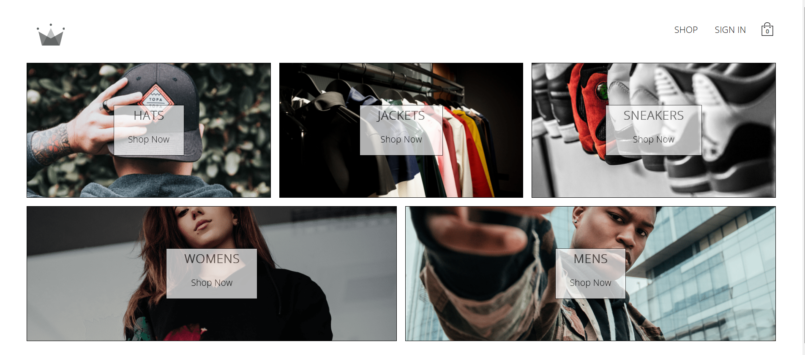

<div id="top"></div>


<!-- PROJECT LOGO -->
<div align="center">

<a href="https://modern-crwn-clothing.vercel.app/">
    
  </a>

  <h1 align="center">Crwn-Clothing</h1>

  <p align="center">
  <a href="https://modern-crwn-clothing.vercel.app/">View Demo</a>
    ·
    <a href="https://github.com/ahmedalam98/Crwn-Clothing/issues">Report Bug</a>
  </p>
</div>

<!-- TABLE OF CONTENTS -->
<details>
  <summary>Table of Contents</summary>
  <ol>
    <li>
      <a href="#about-the-project">About The Project</a>
      <ul>
        <li><a href="#built-with">Built With</a></li>
      </ul>
    </li>
    <li>
      <a href="#getting-started">Getting Started</a>
      <ul>
        <li><a href="#installation">Installation</a></li>
        <li><a href="#stripe">Stripe</a></li>
      </ul>
    </li>
    <li><a href="#contributing">Contributing</a></li>
    <li><a href="#acknowledgments">Acknowledgments</a></li>
  </ol>
</details>

<!-- ABOUT THE PROJECT -->

## About The Project

Full Stack E-Commerce Clothing shop made using React & firebase with Stripe payments implemented.



### Built With

- React
- React Router
- Firebase
- Styled-Components
- Redux
- Redux Saga
- Stripe

<p align="right">(<a href="#top">back to top</a>)</p>

---

<!-- GETTING STARTED -->

## Getting Started

This project require some prequesites and dependenscies to be installed, you can view it online using this [demo](https://modern-crwn-clothing.vercel.app/). or you can find the instructions below:

> To get a local copy, follow these simple steps :

### Installation

#### installing Locally

1. Clone the repo
   ```sh
   git clone https://github.com/ahmedalam98/Crwn-Clothing.git
   ```
2. go to project folder

   ```sh
   cd Crwn-Clothing
   ```

3. install dependenscies

   ```bash
   npm install
   ```

4. Enviromental Variables Set up

   Here are the environmental variables that needs to be set in a `.env` file. This is the default setting that I used for development, but you can change it to what works for you.

   ```
   REACT_APP_STRIPE_PUBLISHABLE_KEY="your stripe publish key "
   STRIPE_SECRET_KEY="your stripe secret key "
   ```

5. Run development server

   ```sh
   npm start
   ```

- To run **serverless function** locally, use [Vercel CLI](https://vercel.com/cli)

  ```sh
  # install CLI-tool globally
  npm i -g vercel

  # login with you account
  vercel login

  # run development server with serverless function
  vercel dev
  ```

<p align="right">(<a href="#top">back to top</a>)</p>

---

### Stripe

- To use test-payment use any dummy data like these:
  - Card Number: `4242 4242 4242 4242`
  - MM/YY: `Any date in the future`
  - CVC: `424`
  - ZIP: `42424`

<p align="right">(<a href="#top">back to top</a>)</p>

---

<!-- CONTRIBUTING -->

## Contributing

Contributions are what make the open source community such an amazing place to learn, inspire, and create. Any contributions you make are **greatly appreciated**.

If you have a suggestion that would make this better, please fork the repo and create a pull request. You can also simply open an issue with the tag "enhancement".
Don't forget to give the project a star! Thanks!

1. Fork the Project
2. Create your Feature Branch (`git checkout -b feature/AmazingFeature`)
3. Commit your Changes (`git commit -m 'Add some AmazingFeature'`)
4. Push to the Branch (`git push origin feature/AmazingFeature`)
5. Open a Pull Request

<p align="right">(<a href="#top">back to top</a>)</p>

<!-- ACKNOWLEDGMENTS -->

## Acknowledgments

- [Yihua Zhang](https://github.com/ZhangMYihua)
